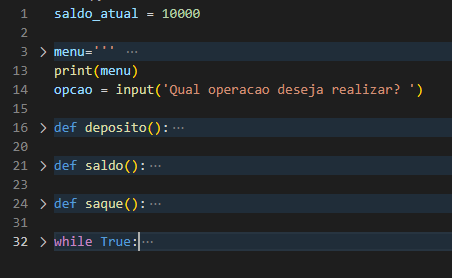

# Projeto Py Bank

## Operações Caixa Bancário


Operações tipicas de um caixa eletronico a partir de esquema de algoritmo proposto.

### Indice
- <a href="#-tecnologia-utilizada">Tecnologia utilizada </a>
- <a href="#-demonstracao">Demonstração </a>
- <a href="#-rodar">Como rodar este projeto </a>
- <a href="#-autor">Autor </a>
- <a href="#-passos">Próximos Passos </a>

### 🛠️ Tecnologia Utilizada
 - [Python](https://www.python.org/)
    - [Instrução if](https://docs.python.org/pt-br/3/reference/compound_stmts.html#the-if-statement)
    - [Instrução while](https://docs.python.org/pt-br/3/reference/compound_stmts.html#the-while-statement)
    - [Função](https://docs.python.org/pt-br/3/reference/compound_stmts.html#function-definitions) 

### 🔍 Demonstração


### 🚂 Como rodar o projeto

```python
# Clone este repositorio
$ git clone

# Acesse a pasta do projeto no seu terminal ou IDE
$ cd Pybank

# Execute o codigo

```
### 👨🏽‍💻Pessoas Autoras
[Marcio Melquiades](https://www.linkedin.com/in/marciomelquiades/)

### Proximos passos
- [ ] Extrato completo com data e hora
- [ ] Função Consulta disponibilidade de empréstimo


